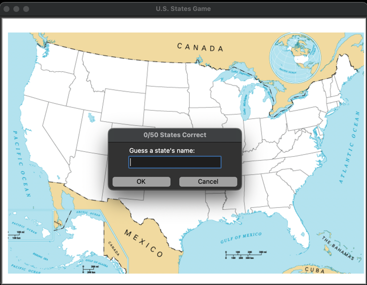

# US-States-Game
This project helps to reinforce knowledge on both names of the states in the U.S. and their locations as well.



## Installation
1. Create a directory on your machine to house it. I find "GAME" to work just fine!
```bash 
mkdir GAME
```
2. Look above and select "Code"
3. From here, copy the HTTPS web URL
4. Return to your terminal and clone the project.
```bash
git clone https://github.com/LanoCodes/US-States-Game.git
```
5. Using your favorite IDE, open the GAME folder
6. Navigate to main and run from there. You will need to have the pandas package installed.

## Usage
- In the text box that appears after you start the game, begin typing in your guesses for states in the U.S. to see them displayed in the location on the map.
- Typing "Exit" allows you to quit the game.
- A text file will be created in the project directory when then game is exited that will allow to see what states you need to work on.

